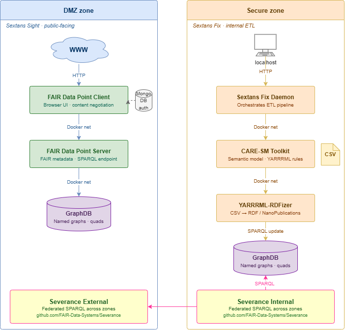

 
   

# Sextans Suite

**Version:** 1.0.0 &nbsp;|&nbsp; [Changelog](CHANGELOG.md)

Sextans Suite is software to support FAIR Metadata (Sextans Sight) and FAIR Data (Sextans Fix) authoring and publishing.

The Sextant is an 18th-century navigational tool that uses celestial bodies and the horizon to determine location at sea. The constellation Sextans (latin for Sextant) depicts a large astronomical sextant, and is located on the celestial equator, and therefore visible from anywhere on earth. The analogy of "FAIRness" being like a Sextant fits both with the purpose of the instrument itself (to navigate and find things) as well as the equatorial nature of the Constellation (findable anywhere on earth).

## In the sea of data, navigation tools are critical!  

**The first step in navigation is deciding where you need to go!**  Sextans Sight creates a Metadata server following the [FAIR Data Point](https://github.com/FAIRDataTeam) specifications that provides automated agents with the ability to determine the for-purpose utility and access conditions of the described resource (database, SKG, catalog, research object). 

**Once the weary traveller has arrived at their destination, give them nourishment!** Sextans Fix creates a set of tools for organizing and publishing data to facilitate their interpretation and integration by following FAIR and Semantic Web best-practies.  

## High-level Architecture

Sextans Sight should be deployed on a publicly-accessible server (e.g. in your Demilitarized Zone), and optimally has no access control - it acts like your institutional homepage, but for machines.

Sextans Fix is an optional second component that includes software for executing data transformations compatible with the [Clinical and Registry Entries Semantic Model (CARE-SM)](https://github.com/CARE-SM/).  Sextans Fix should be deployed inside of your firewall, and can only be accessed via tightly regulated calls from Sextans Sight (see detailed documentation below).

**Note that Severance is an independent (and completely optional) component that is used to provide highly secure access to pre-approved queries for use in a federated Sextans environment.**

## CONTENTS

[Installing Sextans Sight](./Sextans/Sight-install/)

[Installing Sextans Fix](./Sextans/Fix-install/)

## Acknowledgement

This project has been partially supported by funds received from the European Rare Disease Research Alliance [ERDERA](https://erdera.org/), via the European Union’s Horizon Europe research and innovation programme under grant agreement N°101156595. Views and opinions expressed are those of the author(s) only and do not necessarily reflect those of the European Union or any other granting authority, who cannot be held responsible for them.
